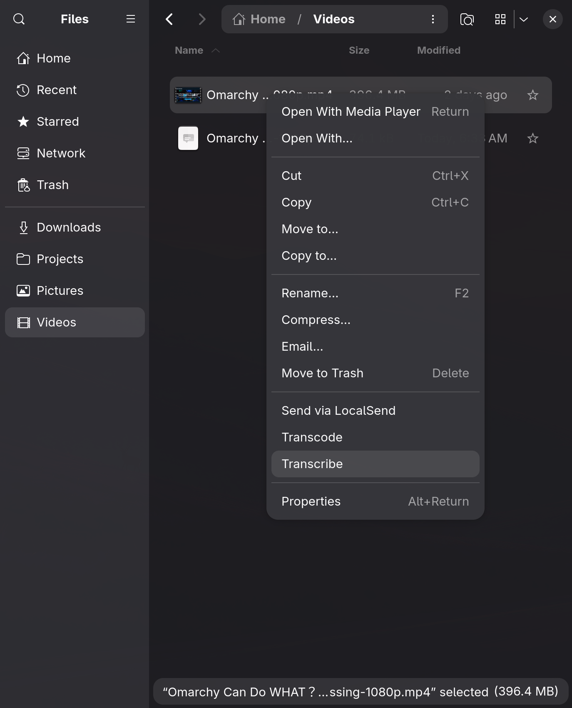
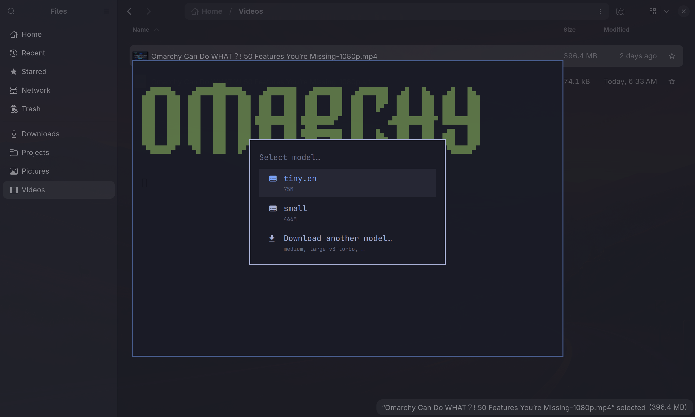

# omarchy-transcribe

SRT subtitles for any video or audio file, written next to it, generated locally with [whisper.cpp](https://github.com/ggerganov/whisper.cpp).

Available as **Transcribe** in the Files right-click menu, in the Omarchy menu, and as `omarchy-transcribe` on the command line.

<p>
  
  
</p>

## Install

```bash
omarchy plugin add https://github.com/mihap/omarchy-transcribe.git --enable
```

Enabling links the command and the Nautilus extension into `~/.local`, adds
the menu row, and opens a terminal once to install `whisper-cpp`, download
the `small` model (~500MB), and install `ggml-vulkan` if you have a Vulkan
driver. It records what it installed so remove can take it back out.

At the end, it offers to restart Files for the context menu entry. Closing
Files windows is not enough: Nautilus keeps running in the background, and
only `nautilus -q` restarts it. If the setup is interrupted, it runs again
on the next shell start.

`omarchy plugin update mihap.transcribe` pulls the repo. Hook log:
`~/.local/state/omarchy-transcribe/plugin.log`.

## Usage

```bash
omarchy-transcribe                          # pick a file, then a model
omarchy-transcribe ~/Videos/talk.mp4        # pick a model
omarchy-transcribe ~/Videos/talk.mp4 small  # no prompts
omarchy-transcribe ~/Videos/talk.mp4 small en
omarchy-transcribe --path ~/Downloads       # limit the file picker
omarchy-transcribe --download medium        # fetch another model
omarchy-transcribe --list-models
omarchy-transcribe --list-available         # well-known models, sizes
omarchy-transcribe --print-config
```

Output is `<dir>/<stem>.srt`, overwritten on every run. Language defaults
to `auto`. The picker lists the last-used model first; its last row
downloads another one. Multi-selecting in Files asks for the model once.

## Models

| Model | Size | Notes |
|---|---|---|
| `tiny`, `tiny.en` | 75M | fastest, rough |
| `base`, `base.en` | 142M | |
| `small`, `small.en` | 466M | default |
| `medium`, `medium.en` | 1.5G | better accuracy, slower |
| `large-v3-turbo` | 1.5G | near large-v3 accuracy, much faster |
| `large-v3` | 2.9G | best accuracy, slowest |
| `*-q5_0`, `*-q5_1` | ~1/3 | quantized variants |

`.en` models are English-only. `--download` and the picker's download row
accept only the models in this table. Each one is fetched from a pinned
commit of [ggerganov/whisper.cpp](https://huggingface.co/ggerganov/whisper.cpp)
on Hugging Face, capped at its recorded size, and kept only if the SHA-256
matches the value shipped with the plugin. Any other `ggml-*.bin` can be
dropped into `~/.local/share/omarchy-transcribe/models/` or a `MODEL_DIRS`
directory by hand.

## Configuration

`~/.config/omarchy-transcribe/config`, a sourced shell file. Only put the
keys you change.

| Key | Default | Meaning |
|---|---|---|
| `MODEL_DIRS` | `$HOME/.local/share/whisper` | Extra model directories, colon-separated. Never deleted. |
| `DEFAULT_MODEL` | `small` | Downloaded on first run. |
| `LANGUAGE` | `auto` | `whisper-cli -l`. |
| `THREADS` | `$(nproc)` | `whisper-cli -t`. |
| `WHISPER_ARGS` | empty | Extra `whisper-cli` flags. |

## Disable and remove

```bash
omarchy plugin disable mihap.transcribe   # unlink; keeps everything else
omarchy plugin remove mihap.transcribe    # also deletes what the setup brought in
```

Remove deletes `~/.local/share/omarchy-transcribe` (the models it
downloaded), its config and state, and the packages its setup installed,
then restarts Files. Your transcripts and any models in `MODEL_DIRS` are
not its to delete and are left alone.

Remove while enabled. If you removed it while disabled, purge by hand:

```bash
bash ~/.local/state/omarchy-transcribe/plugin-disable --purge
```

## Dependencies and license

- `whisper-cpp` and, with a Vulkan driver, `ggml-vulkan`, installed from the
  Arch repos by the first-time setup and removed again by `plugin remove`.
- Whisper models downloaded from
  [ggerganov/whisper.cpp](https://huggingface.co/ggerganov/whisper.cpp) on
  Hugging Face, at the commit and with the SHA-256 values recorded in
  `bin/omarchy-transcribe`.
- `nautilus-python` for the Files entry, part of the Omarchy base install.

MIT, see `LICENSE`.

## Layout

```
manifest.json                     plugin manifest (id mihap.transcribe)
plugin/Service.qml                runs plugin/enable on load, plugin/disable on unload
                                  (/usr/bin/bash, cleared environment, fixed PATH)
plugin/enable                     links, menu row, first-time setup
plugin/setup                      whisper-cpp, model, GPU (floating terminal)
plugin/disable                    unlink; on remove, purge
bin/omarchy-transcribe            the command
bin/omarchy-transcribe-menu       add/remove the menu row
nautilus/omarchy-transcribe.py    Files right-click entry
default/config                    shipped defaults
preview.png                       marketplace preview
screenshots/                      README images
```
